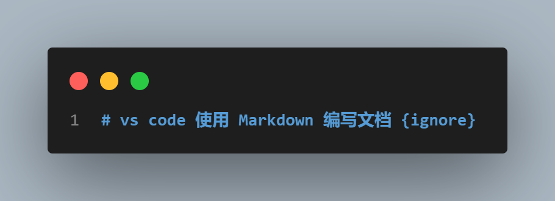
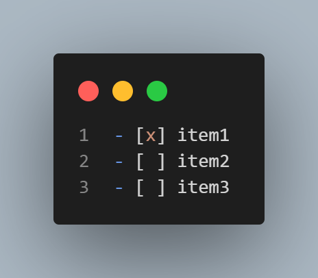

# 使用 Markdown 编写文档 {ignore}

## 锚点测试

### 锚点 ANCHOR 测试

跳到描点讲解：[锚点章节](#锚点)

### 2.1 ANCHOR

跳到描点讲解：[锚点章节](#锚点)

## ingore

<div align=left></div>

标题后面添加{ignore}则目录会忽略该标题;这是 Markdown Preview Enhanced 支持的，github pages 不支持。

## 使用 HTML 标签

直接使用 HTML 标签，可以设置文字居中，字体颜色等样色(HTML 语法)

```code
    <div align="center" style="color:red">VS Code 使用 Markdown 编写文档</div>
```

<div align="center" style="color:red">VS Code 使用 Markdown 编写文档</div>

## 标题写法

```code
    注：# 后面保持空格（和使用 h1/h2 标签功能类似）
    # 标题1
    ## 标题2
    ### 标题3
    #### 标题4
    ##### 标题5
    ###### 标题6
    标题一等价写法：在下面一行写三个等号（=），该文字自动格式化为标题1
    ===
    标题二等价写法：在下面一行写三个横线（-），该文字自动格式化为标题2
    ---
```

## 文本

### 普通文本

这是一段普通的文本

### 单行文本

    Hello,大家好，我是果冻虾仁。

在一行开头加入 2 个 Tab 或者 4 个空格。

### 文本块

#### 语法

在连续几行的文本开头加入 2 个 Tab 或者 4 个空格。

    欢迎到访
    很高兴见到您
    祝您，早上好，中午好，下午好，晚安

#### 换行

直接回车不能换行，  
可以在上一行文本后面补两个空格，  
这样下一行的文本就换行了。

或者就是在两行文本直接加一个空行。

也能实现换行效果，不过这个行间距有点大。

## 引用

### 单行式

```code
    > hello world!
```

> hello world!

### 多行式

```code
    > hello world!
    > hello world!
    > hello world!
    > hello world!
```

> hello world!  
> hello world!  
> hello world!

### 多行嵌套

```code
    > hello world!
    >> hello world!
    >>> hello world!
```

> hello world!
>
> > hello world!
> >
> > > hello world!

## 强调（粗体、倾斜、删除）

`_斜体_`：_斜体_

`**加粗**` ：**加粗**

`**_加粗+斜体_**`：**_加粗+斜体_**

`~~删除线~~`：~~删除线~~

`$\underline{下划线}$`：$\underline{下划线}$

## 高亮 文本

`==高亮==`：==高亮==

> [github pages 不支持](https://www.markdownguide.org/tools/github-pages/#:~:text=Unknown-,Highlight,-No)

## 脚注

`H~2~O`：H~2~O

`n^2^`：n^2^

> [github pages 不支持这种写法](https://www.markdownguide.org/tools/github-pages/#:~:text=Unknown-,Highlight,-No)

## 语义标签

`<i>斜体</i>`：<i>斜体</i>

`<b>加粗</b>`：<b>加粗</b>

`<em>强调</em>`：<em>强调</em>

`<u>下划线</u>`：<u>下划线</u>

`<del>删除</del>`：<del>删除</del>

`Z<sup>a</sup>`：Z<sup>a</sup>

`Z<sub>a</sub>`：Z<sub>a</sub>

`<kbd>Ctrl</kbd>`：<kbd>Ctrl</kbd>

## 分隔符

三个或者更多星号、连接符(横线)、下划线

`***`、`---`、`___`

---

## 代码块

<div align=left></div>

```code
  <div></div>
```

### 语法高亮

#### 选择语言

<div align=left></div>

```javascript
var num = 0;
for (var i = 0; i < 5; i++) {
  num += i;
}
console.log(num);
```

#### 显示代码行数

<div align=left></div>

```javascript{.line-numbers}
  var num = 0;
  for (var i = 0; i < 5; i++) {
    num+=i;
  }
  console.log(num);
```

#### 高亮代码行数

<div align=left></div>

```javascript{highlight=3}
  var num = 0;
  for (var i = 0; i < 5; i++) {
    num+=i;
  }
  console.log(num);
```

<div align=left></div>

```javascript{highlight=1-2}
  var num = 0;
  for (var i = 0; i < 5; i++) {
    num+=i;
  }
  console.log(num);
```

<div align=left></div>

```javascript{highlight=[1,3]}
  var num = 0;
  for (var i = 0; i < 5; i++) {
    num+=i;
  }
  console.log(num);
```

## 行内标记

<div align=left></div>

你好`asdf`你好年后

## 链接

- 外部链接

  <div align=left></div>

  1. https://github.com

  2. [GitHub](https://github.com)

  3. [GitHub](https://github.com "GitHub官网")

- 内部链接

  1. 链接仓库其他文件：[readme](../../README.md)

  2. 链接本文档其他部分(空格用-代替)：[高亮-文本](#高亮-文本)

- 引用式链接

  1. [好看]

  2. 别名：[百度][baidu]

  3. 链接仓库其他文件：[readme]

  4. 链接本文档其他部分：[标记]

## 图片链接

基本格式：

```

```

alt 和 title 即对应 HTML 中的 alt 和 title 属性（都可省略）：

- alt 表示图片显示失败时的替换文本

- title 表示鼠标悬停在图片时的显示文本（注意这里要加引号）

URL 即图片的 url 地址，如果引用本仓库中的图片，直接使用**相对路径**就可了

---

- 外部图片链接
  

- 内部图片链接
  

- 图片引用链接
  ![百度]

## 锚点

其实呢，每一个标题都是一个锚点，和 HTML 的锚点（`#`）类似，比如我们

| 语法                            | 效果                          | 注意点                                                        |
| ------------------------------- | ----------------------------- | ------------------------------------------------------------- |
| `[锚点测试](#锚点-anchor-测试)` | [锚点测试](#锚点-anchor-测试) | 空格用`-`替代;英文尽量用小写 ；大小写相同的标题会只跳到第一个 |
| `[多级序号测试](#21-anchor)`    | [多级序号测试](#21-anchor)    | 多级序号`.`需要去除                                           |

不过要注意，标题中的英文字母都被转化为**小写字母**了。

> 以前 GitHub 对中文支持的不好，所以中文标题不能正确识别为锚点，但是现在已经没问题啦！

## 列表

1. 有序列表:这是一级的有序列表(在 github 中，数字 1 还是 1)
   1. 姓名:这是二级的有序列表(在 github 中，阿拉伯数字在显示的时候变成了罗马数字)
      1. 你好: 这是三级的有序列表(在 github 中，数字在显示的时候变成了英文字母)
      2. 你好
   2. 姓名
   3. 名称
2. 无序列表(使用 \*，+，- 表示无序列表)
   - 阿松大
   * 士大夫
     - 是否
     * 是否
   - 啊手动阀
   * asd

## 表格

<div align=left></div>

| 序号 | 名称 | 性别 | 年龄 |
| ---- | ---- | ---- | ---- |
| 1    | sl   | 男   | 35   |
| 2    | sl   | 男   | 35   |
| 3    | sl   | 男   | 35   |

左右两侧`|`可省略。

### 对齐

表格可以指定对齐方式

<div align=left></div>

| 左对齐        |      居中       | 右对齐 |
| :------------ | :-------------: | -----: |
| col 3 is      | some wordy text |  $1600 |
| col 2 is      |    centered     |    $12 |
| zebra stripes |    are neat     |     $1 |

## GFM

GitHub Flvored Markdom，GFM

markdom 是个规范，GFM 是 github 实现的 markdown 的方案

1. task list

   <div align=left></div>

   - [x] item1
   - [ ] item2
   - [ ] item3

   > 在 GitHub 的**issue**中使用该语法是可以实时点击复选框来勾选或解除勾选的，而无需修改 issue 原文。

2. emojy 表情符号 语法`:emojy code:`
   - :notebook:
   - :sleeping:

## diff 语法

版本控制的系统中都少不了 diff 的功能，即展示一个文件内容的增加与删除。GFM 中可以显示的展示 diff 效果。使用绿色表示新增，红色表示删除。

#### 语法

其语法与代码高亮类似，只是在三个反引号后面写 diff，并且其内容中，可以用 `+ `开头表示新增，`- `开头表示删除。另外还有有 `!`和`#`的语法。

#### 效果

<div align=left></div>

```diff
+ 人闲桂花落，
- 夜静春山空。
! 月出惊山鸟，
# 时鸣春涧中。
```

<!---下面是文档中引用的连接--->

[好看]: http://hao123.com
[baidu]: http://baidu.com
[readme]: ../../README.md
[标记]: ../../README.md#articles
[百度]: ./assets/baidu.png "百度"

## 参考文献

> [Markdown Guide](https://www.markdownguide.org/) > [README](https://github.com/guodongxiaren/README)
