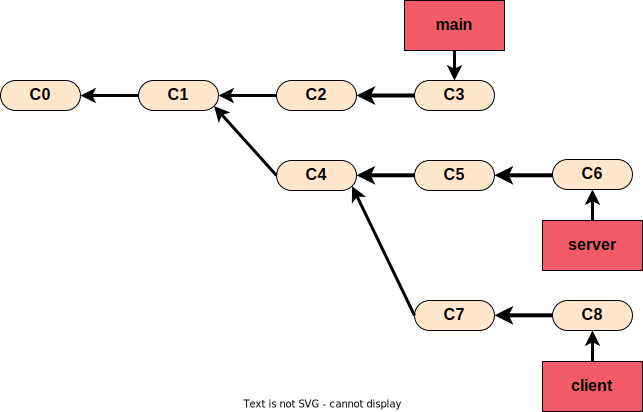
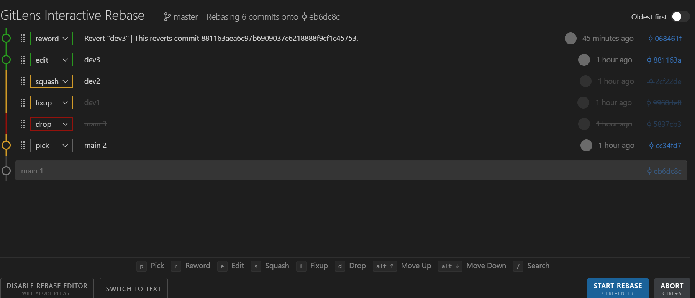

# 2023-03-14-Git 时光机（简单小例子）

## Git 与其他版本控制系统的区别

`Git` 直接记录**快照**，而非**差异**比较

## Git 完整性

`Git` 中所有的数据在存储前都计算校验和，然后以**校验**和来**引用**。`Git` 用以计算校验和的机制叫做 **SHA-1** 散列（`hash`，哈希）。

## Git 基础概念

`Workspace`： **工作区**，就是你平时存放项目代码的地方

`Index / Stage`： **暂存区/索引区**，用于临时存放你的改动，本文统一使用暂存区

`Repository`： **仓库区**（**版本库**）本文统一使用仓库区

`Stash`：**贮藏区**

`Remote`： **远程仓库**

`<remote_name>/<branch_name>`:**本地远程分支引用/本地远程跟踪分支**，本文统一使用本地远程跟踪分支



## 常用指令

### git xxx -h

查看某个指令的帮助信息

### git config

```bash
# 查看git配置
$ git config -l`
# 查看系统配置
$ git config --system --list
# 查看用户配置
$ git config --global --list
# 查看项目配置
$ git config --local --list
# 设置用户名称
$ git config --global user.name xxx
# 设置用户邮箱
$ git config --global user.email xxx
# 启动的编辑器一般为 vim。 当然也可以命令设置你喜欢的编辑器。
# 我一般习惯设置成vscode
$ git config --global core.editor xxx
```

> 💡每一个级别会覆盖上一级别的配置

### git init

初始化一个仓库

### git clone

```bash
# 克隆一个仓库
$ git clone <url>
```

> 💡`git clone` 命令做了什么？

1. 添加一个跟踪的远程仓库`remote`，自动将其命名为 `origin`，拉取它的所有数据 
2. 创建一个`origin/master`（**本地远程跟踪分支**）。 
3. 创建一个 `master` （**本地分支**）

```bash
# 克隆一个仓库
$ git clone —depth=1 <url>
```

通常我们直接使用 `git clone` 即可克隆项目，如果只是使用一个仓库项目，这是加入 **–depth=1**参数可以使我们只下载当前的最新提交即可

### git add

添加工作区的内容至索引区

### git status

显示当前的状态

```bash
$ git status
On branch dev
Your branch is ahead of 'origin/dev' by 2 commits.
  (use "git push" to publish your local commits)

Changes to be committed:
  (use "git restore --staged <file>..." to unstage)
        modified:   a.txt

Changes not staged for commit:
  (use "git add <file>..." to update what will be committed)
  (use "git restore <file>..." to discard changes in working directory)
        modified:   a.txt

Untracked files:
  (use "git add <file>..." to include in what will be committed)
        c.txt
```

1. 显示当前分支与其本地远程跟踪分支（如果有）的关系
   可以通过`git push`推到远程的commit
2. 显示暂存区和本地仓库有差异的文件
   通过运行`git commit`会添加到本地仓库的文件
3. 显示工作区和暂存区有差异的文件
   通过运行`git add`可以添加到暂存区的文件
4. 显示工作区中不被`git`追踪的文件（也不被`.gitignore`忽略）
   通过运行`git add`可以添加到暂存区的文件

### git rm

### git commit

```bash
# 提交变更到本地仓库
$ git commit -m "xxx"
```

```bash
# 修补提交：修补最后的提交
$ git commit --amend
# 修补提交：修补最后的提交，不修改提交信息
$ git commit --amend --no-edit
```

> 💡`git commit --amend`：修补最后的提交时，是完全用一个新的提交替换旧的提交。修补提交最明显的价值是可以稍微改进你最后的提交，例如一些小的修补，笔误等等；可以像下面这样操作：

```bash
# 第一次提交
$ git commit -m 'initial commit' 
# 修改笔误等
$ git add forgotten_file
# 第二次提交
$ git commit --amend
```

> 💡最终你只会有一个提交；第二次提交将代替第一次提交的结果。

> 💡假如你的代码已经 `push` 了的话，`git commit --amend`要慎用，因为会修改提交历史。

```bash
# 带签名的提交
git commit --signoff -m 'xxxx'
```

### git log

```bash
# 基本用法
$ git log
# 仅显示最近的 n 条提交
$ git log -<n>
# 按补丁格式显示每个提交引入的差异
$ git log -p
# 显示每次提交的文件修改统计信息
$ git log --stat
# 在日志旁以 ASCII 图形显示分支与合并历史
$ git log --graph
# 每条日志一行显示
$ git log --pretty=oneline
# 仅显示 SHA-1 校验和所有 40 个字符中的前几个字符
$ git log --abbrev-commit
# --pretty=oneline --abbrev-commit 合用的简写。
$ git log --oneline
# 仅显示作者匹配指定字符串的提交。
$ git log --author='xxx'
```

### git 命令别名

```bash
# 设置log -1 HEAD的别名为last
$ git config --global alias.last 'log -1 HEAD'
# 使用last别名
$ git last
```

### git diff

```bash
# 比较工作区与暂存区之间的差别
$ git diff
# 比较暂存区与本地仓库之间的差别
$ git diff —cached（git diff —staged）
# 比较工作区和暂存区（即所有未提交到本地仓库的修改）与本地仓库当前的HEAD之间的差别
$ git diff HEAD
# 比较工作区和暂存区（即所有未提交到本地仓库的修改）与本地仓库dev分支最新commit之间的差别
$ git diff dev
# 比较工作区和暂存区（即所有未提交到本地仓库的修改）与本地远程跟踪dev分支最新commit之间的差别
$ git diff origin/master
# 比较两次提交之间的差别
$ git diff [commit_sha1_value] [commit_sha1_value] 
```

### git tag

有两种tag，一种是**lightweight**，**轻量标签**；一种是**annotated tag**，**附注标签**

```bash
# 显示所有
$ git tag
# 创建lightweight tag（轻量标签）
# 如果没有写commit_sha1_value，则会自动把tag放到目前的这个commit上
$ git tag <tag_name> [commit_sha1_value]
# 创建annotated tag（附注标签）
# 如果没有写commit_sha1_value，则会自动把tag放到目前的这个commit上
$ git tag -a <tag_name> -m <tag_message> [commit_sha1_value]
# 删除tag
$ git tag -d <tag_name>
```

> 💡**轻量标签**很像一个不会改变的分支——它只是某个特定提交的**引用**。

> 💡**附注标签**是存储在 `Git` 数据库中的一个完整**git的tag类型的objects**对象， 它们是可以被校验的，其中包含打标签者的名字、电子邮件地址、日期时间， 此外还有一个标签信息

### git show

```bash
# 显示tag对应的commit所提交的内容，如果是附注标签，还是显示附注标签的信息
$ git show <tag_name>
# 显示某次commit提交的内容
$ git show <commit_sha1_value>
```

### git branch

```bash
# 查看本地仓库分支
$ git branch
# 查看远程仓库分支
$ git branch -r
# 查看本地仓库和远程仓库分支
$ git branch -a
# 创建本地仓库分支
$ git branch <branch_name>
# 强制删除本地仓库分支
$ git branch -D <branch_name>
# 删除本地仓库分支
$ git branch -d <branch_name>
# 查看分支详细信息，包括分支最后一个commit的hash、message等
$ git branch -v
# 同git branch -v
$ git branch -vv
# 修改本地仓库分支名称，如果省略old_branch_name，则更改的是当前分支的名称
$ git branch -m <old_branch_name> <new_branch_name>
# 强制修改本地仓库分支名称
$ git branch -M <old_branch_name> <new_branch_name>
# 查看哪些分支已经合并到当前分支
$ git branch --merged
# 查看哪些分支未合并到当前分支
$ git branch --no-merged
```

> 💡`git branch -d <branch_name>`：**如果该分支还未合入master或者main,会提示报错，不让删除**

> 💡`git branch -vv`：**同时还会显示每一个分支正在跟踪哪个远程分支**

### git checkout

```bash
# 切换到新分支
$ git checkout <branch_name>
# 创建并切换到新分支 
$ git checkout -b <branch_name>
# 重置分支，删除已存在的分支且重新创建，分支不存在也不会报错称
$ git checkout -B <branch_name>
# 将head指向一个commit
$ git checkout <commit_sha1_value>
# 从某个本地远程跟踪分支中检出一个新分支（并设置该分支的上游是远程跟踪分支）
$ git checkout -b <new_branch_name> <remote_name>/<old_branch_name>
# 是 git checkout -b <new_branch_name> <remote_name>/<old_branch_name>的简写
$ git checkout --track <remote_name>/<branch_name>
# 让工作区中的所有文件撤销更改
$ git checkout -- .
# 让工作区中的某些文件撤销更改
$ git checkout -- <file_name> <file_name> 
```

> 💡 `git checkout -b <new_branch_name> <remote_name>/<old_branch_nameh>`
> 💡 `git checkout --track <remote_name>/<branch_name>`
> 💡 `git checkout <branch_name>`
> `git checkout -b <new_branch_name> <remote_name>/<old_branch_nameh>`的意思是从某个本地远程跟踪分支中检出一个新分支，并设置该新分支的上游是该本地远程跟踪分支；
> 因为`git checkout -b <new_branch_name> <remote_name>/<old_branch_nameh>`经常用，且检出的新分支名字和其上游分支的名字一般相同，不太会取不同的名字；所以出了一个简写命令`git checkout --track <remote_name>/<branch_name>`
> `git checkout --track <remote_name>/<branch_name>`该命令从某个本地远程跟踪分支中检出一个新分支，并设置该新分支的上游是该本地远程跟踪分支，同时该新分支的名字不能指定，只能是该本地远程跟踪分支的名字
> `git checkout --track <remote_name>/<branch_name>`还是太长；所以 `git checkout branch_name` 切换分支时，先从本地库查找分支，在本地库没找到时，会去本地远程跟踪分支中查找，如果本地远程跟踪分支中有相同名称的分支，则也会检出分支并设置其上游为同名的本地远程跟踪分支；如果本地远程跟踪分支里也没有找到就会报错;

> 💡`git checkout <commit_sha1_value>`：这样会发生**detached head**,即`head`不再指向一个分支，而是指向一个`commit`；
> 应用场景是比如从之前的`commit`或者误删的`commit`(通过给`git reflog`查看)；拉出一个新分支

  ```bash
  # 查看所有操作的日志
  $ git reflog
  # 检出需要检出的commit
  $ git checkout <ommit_sha1_value>
  # 检出一个新的分支
  $ git checkout -b <new_branch_name>
  ```

> 💡`git checkout --`的撤销功能：`git checkout`撤销的是工作区的内容，即**清除工作区**
> 场景一、本地库中已有 `user.txt`，**在工作区修改了该文件，但是没有提交到暂存区，此时撤销更改是从本地仓库中恢复内容**
> 场景二、本地库中已有 `user.txt`，**在工作区修改了该文件，并且之前按已提交到暂存区，此时撤销更改是从暂存区中恢复内容**

### git restore

替代`git checkout`的撤销功能

```bash
# 放弃在工作区的修改
$ git restore <file_name> <file_name>
# 放弃所有文件在工作区的修改
$ git restore .
# 将暂存区的内容，移动工作区中，即是git add的反向操作
$ git restore  —staged <file_name> <filen_ame>
```

> 💡`git restore <file_name> <file_name>`替代`git checkout -- <file_name> <file_name>`

> 💡`git restore .`替代`git checkout -- .`  

> 💡`it restore  —staged <file_name> <filen_ame>`：`git add` 的反向操作

### git switch

替代`git checkout`的切换分支功能

```bash
# 如果本地仓库或者本地远程跟踪分支有这个分支，则切成功，否则失败
$ git switch <branch_name>
# 创建并切换到新分支 
$ git switch -c <branch_name>
# 重置分支，删除已存在的分支且重新创建，分支不存在也不会报错称
$ git switch -C <branch_name>
```

> 💡`git switch <branch_name>`替代`git checkout <branch_name*>`

> 💡`git switch -c <branch_name>`替代`git checkout -b <branch_name>`

> 💡`git switch -C <branch_name>`替代`git checkout -B <branch_name>`
  
> 💡`git switch -`可以快速切换上一个分支，来回切换，与 `cd -`一样

### git remote

```bash
# 显示远程仓库的名字
$ git remote
# 显示远程仓库的名字及url
$ git remote -v
# 查看本地远程跟踪分支与远程仓库中分支的同步情况
$ git remote show <remote_name>
# 可以删除（在远程仓库中被删除的分支）对应的本地远程跟踪分支
$ git remote prune <remote_name>
```

> 💡`git remote show <remote_name>`：一般应用场景就是在`git fetch`之前查看一下分支同步情况

> 💡`git fetch —prune`与`git remote prune`的作用一样，实际上删除（远程仓库中被删除的分支）对应的本地远程跟踪分支。

### git rebase

#### 变基

```bash
$ git rebase <upstream_name>
# 当前分支为dev
$ git rebase main
# 如果有冲突，解决冲突后继续编辑
$ git rebase —continue
# 当前分支为main
$ git merge dev
```

> `git rebase <upstream_name>`做了什么？
> `git rebase main`（`dev`）把`dev`分支的提交**重放**（重新应用）到`main`分支的顶部。



> `git rebase --onto main server client`做了什么？
> 对于这个指令，每次看到都头大，需要自己用文字描述一下，以方便理解


```bash
# newbase_name\upstream_name\branch_name既可以是分支名，也可以是commit_sha1_value
$ git rebase [--onto <newbase_name>] [<upstream_name> | [branch_name]]
```

>💡 如何理解上面这条指令各个参数是啥意思？列出具体指令来尝试讲解

1. 场景及公式一：
   场景：假设`dev`是从`master`检出的分支，要在`dev`分支上变基，当前所在分支不是`dev`分支
   公式：`git rebase <upstream_name>`：`git rebase master`

    ```bash
    # 切换到dev分支
    git checkout dev
    # rebase master，这个master是对应upstream_name；怎么理解这里的上游分支
    # 实际上就是dev是从master检出的，是dev的上游分支，依此来找到两个分支的交叉点
    # 把在dev分支上以这个交叉点为起点，以当前HEAD为终点（dev最新commit），把这两点之间的
    # commit在master分支顶部（最新commit），重新来一遍，得到一个新的dev分支。
    git rebase master
    ```

2. 场景及公式二：
   场景：假设`dev`是从`master`检出的分支，要在`dev`分支上变基，当前所在分支不是`dev`分支
   公式：`git rebase <upstream_name> [branch_name]`：`git rebase master dev`

    ```bash
    # git rebase master dev 是 git checkout dev + git rebase master 这两条命令的简写
    # 就是我先切到dev分支，再rebase master分支
    git rebase master dev
    ```

3. 场景及公式三：
   场景：假设当前所在分支是`dev`分支，其本地远程跟踪分支是`origin/dev`
   公式：`git rebase`

    ```bash
    # git rebase 是 git rebase origin/dev 命令的简写
    git rebase
    ```

    > 💡 简写的前提是
    >
    > 1. 当前不是**detached headhead**状态
    > 2. 当前分支有对应的本地远程跟踪分支（即上游分支）

4. 场景及公式四：
   场景：<div align=left></div>
   公式：`git rebase --onto main server client`

    ```bash
    # 有了上面的理解，这条命令就比较好解释了
    # 第一步：git checkout client
    # 第二步：根据client和其上游分支server来找到交叉点之后的所有commit
    # 第三步：这些commit不在基于server的最新commit为基点，而是以--onto参数的值为基点，重放这些commit
    git rebase --onto main server client
    ```

- 应用场景
  1. 在合并分支前，不想分叉，可以先`rebase`目标分支，再合入目标分支
  2. 同步远程分支时，不使用`git pull`，使用`git fetch`，再使用`git rebase`

> 💡 共享分支：当一个分支会被`push`到远程仓库，且有可能其他人会进行`pull`操作时，这就是一个共享分支

> 💡 Do not rebase commits that exist outside your repository and that people may have based work on.

> 💡 **永远、永远不要rebase一个共享分支**。

> 💡 假如说一个分支只有你自己用，你可以`rebase`,但是你的这个分支别人也在用，那就不要`rebase`,否则别人拉下来你的分支作开发，你`rebase`推上去之后，对于别人会有一定的麻烦；一般开发中，没人都在自己的特性分支上开发，都去`rebase`同一个`dev`分支，这是比较好的开发方式。但是如果你在你自己的特性分支上开发，`rebase dev`分支，而另一个人拉了你的分支，然后在你的分支上开发，他在推送到你的远程特性分支上就有可能会碰到麻烦

#### 交互式变基

```bash
# start_commit_sha1_value不包含，end_commit_sha1_value包含
# end_commit_sha1_value可以没有，则默认为当前分支的HEAD
$ git rebase -i [start_commit_sha1_value] [end_commit_sha1_value]
# 如果你异常退出了变基选择操作的窗口，使用以下命令重新打开
$ git rebase --edit-todo
# 放弃变基
$ git rebase --abort
```

```bash
# 保留，啥也不动
**p, pick <commit> = use commit**
# 只修改提交信息
**r, reword <commit> = use commit, but edit the commit message**
# 不只是修改提交信息
**e, edit <commit> = use commit, but stop for amending**
# 并入前一个提交
**s, squash <commit> = use commit, but meld into previous commit**
# 并入前一个提交，并丢弃该提交信息
**f, fixup [-C | -c] <commit> = like "squash"
       but keep only the previous commit's log message,
       unless -C is used,in which case keep only this commit's message; 
       -c is same as -C but opens the editor
# 删除该提交
**d, drop <commit> = remove commit**
```

建议使用`vscode`中的`GitLens`插件来进行交互式变基，如下图


### git fetch

会拉去数据，同时会同步所有**远程仓库分支**和**本地远程跟踪分支**，对于本地远程跟踪分支，实际上就是为了区分本地仓库分支，前面加了`remote_name`的分支引用

💡`git fetch` 命令做了什么？

1. 拉取它的所有数据 
2. 更新你的远程跟踪分支
3. 对与远程仓库中有而本地没有的分支，只会创建远程跟踪分支，不会创建本地分支

💡 **当抓取到新的远程跟踪分支时(这句话的意思是比如远程仓库新建了一个分支dev，当`git fetch`时就会拉取新远程分支到本地的远程跟踪分支`origin/dev`)，但不会创建一个本地`dev`分支**。

1. 如何只是想合并到你的分支，可以执行`git merge origin/dev`
2. 如果想在本地分支的工作，可以从`origin/dev`检出一个本地的`dev`分支,执行`git checkout -b dev origin/dev`

```bash
# 从远程仓库中拉去所有分支数据到本地，同步所有远程仓库分支和本地远程跟踪分支，如果缺省远程仓库名，默认为origin
$ git fetch <remote_name>
# 从远程仓库中只拉取一个分支数据到本地
$ git fetch <remote_name> <remote_branch_name>
# 从远程仓库中只拉取一个分支数据到本地，并在本地仓库中创建一个分支
$ git fetch <remote_name> <remote_branch_name>:<local_branch_name>
# 首先会同步远程仓库分支与本地远程跟踪分支，同时会将本地远程跟踪分支中存在而远程仓库分支没有的分支删除。
$ git fetch —prune
# 显示fetch的详细信息
$ git fetch -v
```

> 💡`git fetch —prune`：比如初始状态时远程仓库分支和本地远程跟踪分支已经同步；
> 此时，在远程仓库中删除某个分支`a`，再使用`git fetch`时，本地远程跟踪分支中的分支`a`不会删除；
> 此场景下可以使用`git fetch —prune`，也可以使用`git remote prune <remote_name>`

- 应用
  1. 应用一        
    `git fetch origin master` //从远程`origin`仓库拉取`master`分支的数据，同时同步**本地远程跟踪分支** `master`
    `git log -p master origin/master` //比较**本地仓库**的`master`分支和**本地远程跟踪分支**`master`的区别    
    `git merge origin/master` //将**本地远程跟踪分支**中的`master`分支合入**本地仓库**的`master`分支        
  2. 应用二        
    `git fetch origin master:temp` //从远程的`origin`仓库拉取`master`分支的数据，并在**本地仓库**中新建一个分支`temp`
    `git diff temp` //比较**本地仓库**当前分支和**本地仓库**`temp`分支的差别   
    `git merge temp` //合并**本地仓库**`temp`分支到**本地仓库**`master`分支    
    `git branch -d temp` //删除**本地仓库**`temp`分支

### git merge



```bash
# 默认采用fast forward
$ git merge
# 采用fast forward
$ git merge -ff
# 强行关闭fast forward
# 个人觉得应用场景是：拉取远程分支，检出自己的分支上开发，然后push前rebase一下远程分支，提个pr,采用git merge --no--ff的方式merge到远程分支。
$ git merge --no-ff
```

1. `fast forward`：这时候`bugfix`合入`master`是一次`fast forward`    
2. `3 way merge`

> 💡 如果已经分叉了，还想实现`fast-forward`的`merge`,可以使用`git rebase`

### git pull

`git fetch` + `git merge`

```bash
# git fetch + git merge
$ git pull
# git pull的简写
$ git pull --merge
# git fetch + git rebase
$ git pull --rebase
# 显示详细信息
$ git pull -v
```

### git push

将本地仓库当前分支推出送远程分支

```bash
# 完整命令，对于没有设置上游的本地分支推送至远程采用的方法
$ git push <remote_name> <local_branch_name>:<remote_branch_name>
# 如果本地分支名和远程分支名一样的情况下，可以省略:<remote_branch_name>
$ git push <remote_name> <local_branch_name>>
# 设置当前的分支的上游分支是
$ git push —set-upstream <remote_name> <remote_branch_name>
# git push -u origin是git push —set-upstream origin的简写
$ git push -u <remote_name> <remote_branch_name>
# 删除远程分支
$ git push <remote_name> -d <remote_branch_name>
# 删除远程分支
$ git push <remote_name> :<remote_branch_name>
# 推送某个标签
$ git push <remote_name> <tag_name>
# 一次性推送很多标签
$ git push origin —tags
# 删除远程标签的方式
$ git push origin --delete <tag_name>
```

> 💡`git push`简写命令使用前提条件是：
>
> 1. **远程仓库有这个分支**
> 2. 并且通过`git branch -vv`查看，**本地仓库当前分支与本地远程跟踪分支是关联的**
> 3. **并且当前只有一个`origin`的`remote`**

> 💡`git push <remote_name> <local_branch_name>`：将本地仓库分支推送到远程仓库；这样操作，虽然会同时更新本地远程跟踪分支；并没有将本地的该分支与对应的本地远程跟踪分支进行关联（通过`git branch -vv`查看）

> 💡新建本地分支后`push`到远程仓库，但并没有将本地分支与对应的本地远程跟踪分支相关联，下次本地分支有新的`commit`后，再`push`到远程，依然要`git push <remote_name> <local_branch_name>`，不能直接用`git push`这样的简写命令

> 💡`git push -u <remote_name> <remote_branch_name>`：将新建的本地分支推送到远程分支，并将该分支与对应的本地远程跟踪分支相关联，下回再推送时就可以使用`git push`这样的简写

### git revert

```bash
git revert <commit_sha1_value>
git revert HEAD
git revert HEAD^
git revert HEAD~
```

下图是在`C5`为当前`HEAD`，分别对`C5`、`C4`、`C3`、`C2`、`C1`、`C0`进行`revert`


> 💡**区别：`HEAD^`主要是控制`merge`之后回退的方向；`HEAD~`才是回退的步数**
> **个人理解：如果某个节点只有一个父节点，那就用`~`，不要用`^`,因为不太直观，容易混乱；只针对有多个父节点的回退操作采用`^`。**

```bash
git revert -m <commit_sha1_value>
git revert -m HEAD
git revert -m HEAD^
git revert -m HEAD~
```

>💡revert主要分两类，一类是针对只有一个父节点的commit,一类是针对有两个父节点的commit（merge分支产生的）

>💡**什么时候加-m，当该节点是merge产生的节点的时候，它会有2个父节点（之前老是记不清，一个commit节点是不可能有多于2个父节点的，通过这个-m的参数才想起来，所以这个-m后面跟的数字只能是1和2，1代表我保留自己的分支，2代表保留合入的分支）**

>💡`revert`可能带来的问题如下图描述


对于此问题官网给出的解决方案是在`master`上`revert`掉之前的`revert`,然后再`merge`

### git reset

- `git reset —mixed <commit_sha1_value>`（默认选项）
- `git reset —soft <commit_sha1_value>`
- `git reset —hard <commit_sha1_value>`:
- `git reset HEAD`：感觉和`git restore —staged`差不多

下图是在`C5`为当前`HEAD`，分别`reset`到`C4`、`C3`、`C2`、`C1`、`C0`可以使用的命令


> 💡 `revert`与`reset`的区别是什么
`git revert`是用一次新的`commit`来回滚之前的`commit`，此次提交之前的`commit`都会被保留；`git reset`是回退到某次提交，提交及之前的`commit`都会被保留，但是此之后的`commit`都会被删除；所以可以说`revert`是以新增`commit`的方式**回滚某个**`commit`；而`reset`是**回退到**某个`commit`
> 💡 单从用法上来讲，应用场景可以参考以下：
> 找出有问题的`commit`，如果从HEAD一直到有问题的`commit`之间都不要，那就用`reset`；如果从`HEAD`一直到有问题的`commit`之间，只想回滚有问题的`commit`，中间其他的`commit`还要保留，那就用`revert`
> 💡 以上过于啰嗦了，简单点，就是**回滚某个**`commit`用`revert`，**回退到**某个`commit`用`reset`；所以对于`git reset HEAD`这个命令是无意义的，当前就在这个`commit`，要回退到这个`commit`岂不是无用功；对于`git revert HEAD`这个命令是有意义的，如果你确实想回滚当前的`commit`

### git cherry-pick

### git stash

```bash
# 保存工作区暂存区中的内容
git stash
# 保存工作区暂存区中的内容，并添加注释，不推荐使用
git stash save 'message'
# 保存工作区暂存区中的内容，并添加注释，推荐使用
git stash push -m 'message'
# 恢复后同时弹出 stash
git stash pop
# 恢复后stash内容并不删除
git stash apply
# 删除stash
git stash drop
# 清空`stash`
git stash clear
# 显示所有的stash
git stash list
# 显示最新缓存修改的统计信息
git stash show
```

> 💡 在使用`git stash pop`代码时，经常会碰到有冲突的情况，一旦出现冲突的话，系统会认为你的`stash`没有结束。导致的结果是`git stash list` 中的列表依然存在，实际上代码已经`pop`出来了。

- 应用场景
    1. 正常dev分支上开发，紧急bug或者功能来时，可以先将在dev分支做的工作用`git stash save`存下，然后切换到紧急分支，修复或者完成`commit`之后，在切回dev分支，用`git stash pop`将之前的工作内容回复

### git worktree

### git prune

### git gc

由于`git`是全量快照，每一次`commit`都会对应一个版本的全部数据，这样会造成仓库很大，为了解决该问题，引入了压缩算法，举例，`git clone`在拉取远程仓库时，就会压缩成`pack`后再传递；在本地执行`gc`后，也会把`.git/objects`文件夹下的对象压缩到`pack`文件夹下。

### git cat-file

git cat-file -p sha1hash

git cat-file -t sha1hash

### git ls-files -s

### git hooks

- pre-commit

### FETCH_HEAD

记录了远程所有分支对应的最新的`commit`

### ORIG_HEAD

记录了？记录了分支`merge`之前的`head`

## Git中的其他概念

### .git中objects文件夹下的对象

有四种类型：`blob`、`commit`、`tree`、`tag`

1. `git add .`：会生成`blob`对象
2. `git commit`：会生成一个`commit`对象（包含）、`tree`对象（可有有多个），不会生成`blob`对象
3. `git tag -a tagname -m message`：会生成`tag`对象（`git tag tagname`不会生成`tag`类型的对象）    
    1. `git tag tagname`自会创建一个指向某一个`commit`的指针    
    2. `git tag -a tagname`会创建一个`tag`对象，对象中的`object`会指向某一个`commit`；`tag`对象会包含一些作者和时间的信息等等

### 本地远程跟踪分支 上游分支

从一个远程跟踪分支检出一个本地分支会自动创建所谓的**跟踪分支**（它跟踪的分支叫做**上游分支**，即跟踪的是远程仓库的分支）； 跟踪分支是与远程分支有直接关系的本地分支； 如果在一个跟踪分支上输入 `git pull`，`Git` 能自动地识别去哪个服务器上抓取、合并到哪个分支。
