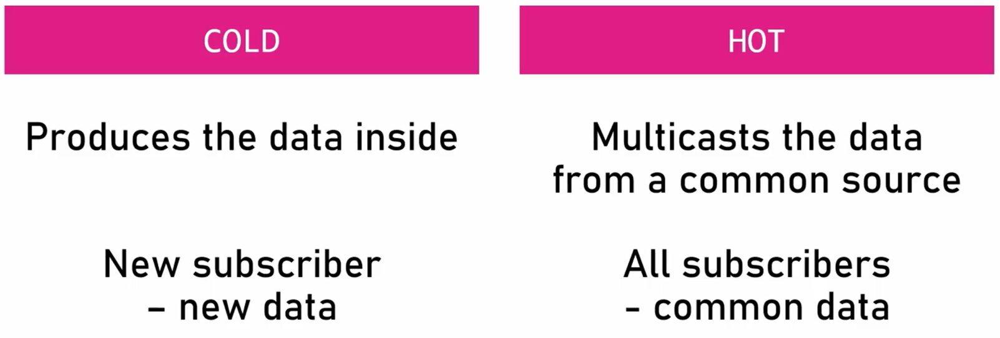

# 2023-04-04-Rxjs（简单小例子）

## cold observable 与 hot observable 的区别

cold observable中的数据是observable内部产生的，每个订阅收到的数据都独立于其他订阅产生的数据；
hot observable中的数据是observable外部产生的，每个订阅收到的数据都来自于相同的数据源；相当于把公共数据源的数据广播到各个订阅者

cold observable是否可以理解成vip用户

## Creation Functions Observable

## Pipeable Operators

operator不是更改原有的observable,而是产生一个新的扩展的observable

## Flattening Operators

## Subject

Subject的工作模式是多播；是一个 hot observable，同时也是一个Observer

## BehaviorSubject

`BehaviorSubject`与`Subject`的区别是，`Subject`对于后面订阅者不会发出之前的数据，只有在订阅者加入之后新的数据产生时，才能收到数据
`BehaviorSubject`会在订阅者订阅的时候就发送之前最后一次产生的数据，这样就可以得到订阅的最新消息

1. `Observer` 观察者只是具有处理数据的能力
2. `SafeSubscriber`
    1. `SafeSubscriber`确保传入的符合规则，如果是一个函数，就变成一个`Observer`
    2. 将处理过的`Observer`作为`ConsumerObserver`类的构造参数，实例化一个安全的观察者，把`Observer`的`next`,`complete`，`error`都套上`try catch`,并将该实例保存到自己的`destination`属性中
    3. ok,我已经完成了我的工作，把传入的观察者变成了一个更为安全的观察者保存了起来，但我不具备订阅者的能力啊，比如`next`,`complete`，`error`方法我都没有，取消订阅的方法我也没有，没关系，我去继承继承`Subscriber`类，
    4. `SafeSubscriber`可以通过调用`Subscriber`类的`next`,`complete`，`error`方法，来对应触发`destination`中的方法，但为什么要套一层呢？因为这里的`complete`与`error`方法不只是单独的调用对应的`destination`中的方法，因为要维护内部的状态，比如已经调用`complete`方法了，再调用`next`方法，是不合理的，需要内部状态来维护，`isStoped`属性，以及`error`方法时也要处理状态；以及当`complete`与`error`执行后都要自动的取消订阅，以及`unsubscribe`方法调用的时候也要设置`isStoped`属性,这一系列的功能都有`Subscriber`来实现。
    5. ok,我可以完成数据的转发，也可以取消观察者的订阅了，但是可观察对象在生产数据完成的时候有一些资源要处理怎么办，没关系，`Subscriber`取消订阅只是设置`isStoped`属性为true,并没有释放资源，好吧，那让`Subscriber`去继承`Subscription`吧，我这里来处理清理资源 
3. `Subscriber`
4. `Subscription`
